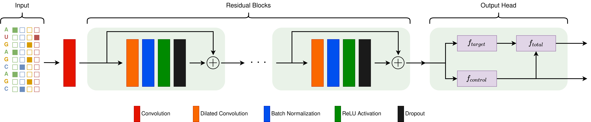

# RBPNet

RBPNet is a sequence-to-signal model that predict the distribution of (e)CLIP-seq crosslink counts along an input RNA sequence. This prediction server takes as input a FASTA file or sequence and outputs RBPNet signal shape predictions of ENCODE eCLIP experiments. 

